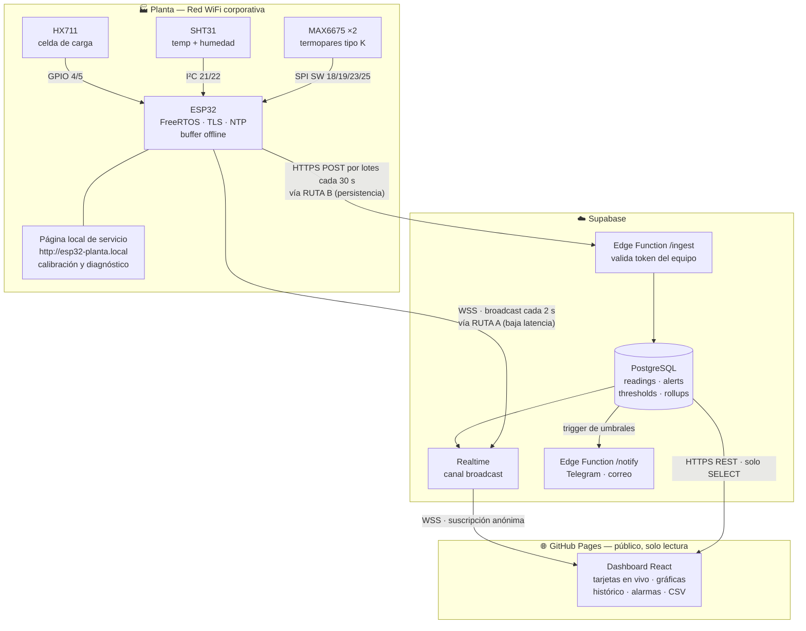

# Sistema de Monitoreo Remoto ESP32 — Arquitectura Técnica

**Proyecto:** Telemetría en tiempo real de sensores MAX6675 (×2), SHT31 y HX711
**Dashboard:** Página estática pública alojada en GitHub Pages
**Versión del documento:** 1.0
**Fecha:** 2026-08-12

---

## 1. Resumen ejecutivo

El sistema captura cinco magnitudes físicas (peso, temperatura ambiente, humedad relativa y dos temperaturas de proceso por termopar), las transmite desde un ESP32 conectado a la red WiFi local hacia un backend en la nube (Supabase), y las expone en un dashboard web público de solo lectura publicado en GitHub Pages.

El dashboard entrega:

- **Estado en vivo** de cada sensor con latencia ≤ 2 s.
- **Salud del dispositivo y de cada canal** (en línea / degradado / falla / dato obsoleto).
- **Histórico consultable** con gráficas por rango de tiempo y exportación a CSV.
- **Motor de alarmas** con umbrales configurables, histéresis, registro de eventos y notificación.

---

## 2. Restricción fundamental que define la arquitectura

Esta es la decisión de diseño más importante y conviene entenderla antes de cualquier otra cosa.

**GitHub Pages sirve exclusivamente por HTTPS y solo contenido estático.** El ESP32 vive detrás del NAT de la red corporativa de planta, con una IP privada (`192.168.x.x`). De ahí se derivan tres bloqueos simultáneos:

| Bloqueo | Consecuencia |
|---|---|
| **Sin ruta desde internet** | Ningún visitante externo puede alcanzar `192.168.x.x`. El NAT no expone el dispositivo. |
| **Mixed content** | Una página servida por `https://` no puede hacer `fetch()` a un `http://` sin TLS. El navegador lo bloquea sin posibilidad de excepción. |
| **Sin backend en Pages** | GitHub Pages no ejecuta código de servidor. No hay dónde poner un proxy. |

**Conclusión:** el patrón "la página consulta al ESP32" es inviable. La única arquitectura correcta es **inversión del flujo**: el ESP32 *publica hacia afuera* a un servicio en la nube con TLS, y el dashboard *se suscribe* a ese servicio. El ESP32 nunca recibe conexiones entrantes desde internet, lo cual además es la postura de seguridad deseable.

> Alternativas descartadas y por qué: *port forwarding* (expone el dispositivo a internet, requiere IP pública fija o DDNS, y política de TI difícilmente aprobará abrir puertos); *túnel Cloudflare/ngrok* (introduce un demonio adicional que el ESP32 no puede ejecutar, requiere un host intermedio siempre encendido); *servir la página desde el propio ESP32* (no accesible desde fuera, y el ESP32 no soporta la carga de múltiples visitantes concurrentes con TLS).

---

## 3. Arquitectura general



### 3.1 Doble ruta de datos (decisión clave)

El sistema usa **dos caminos distintos** para el mismo dato. No es redundancia accidental: cada ruta optimiza un objetivo diferente y en conjunto mantienen el proyecto dentro del *free tier*.

**Ruta A — Tiempo real (baja latencia, sin escritura a disco)**
El ESP32 publica un mensaje *broadcast* al canal Realtime cada 2 segundos, mediante un `POST` HTTPS al endpoint de broadcast (no abriendo un WebSocket: implementar el protocolo Phoenix sobre un ESP32 es mucho código frágil, y el consumo de cuota es idéntico). El dashboard está suscrito por WSS y pinta las tarjetas al instante. Este dato **no toca la base de datos**, por lo que no consume filas ni invocaciones de Edge Function. Es efímero por diseño: si nadie está viendo, no cuesta nada.

El canal es **privado**: publicar exige un JWT de dispositivo con el claim `device_slug`, que vive solo en la NVS del ESP32. Sin esto, la `anon key` —que es pública por ir incrustada en el dashboard— permitiría a cualquier visitante inyectar lecturas falsas en el canal.

**Ruta B — Persistencia (histórico, alarmas, auditoría)**
El ESP32 acumula muestras en RAM y envía un **lote cada 30 segundos** vía HTTPS a la Edge Function `/ingest`, que valida el token del equipo e inserta en PostgreSQL. De ahí salen las gráficas históricas, la evaluación de umbrales y el registro de alarmas.

Separar ambas rutas es lo que permite tener latencia de 2 s **y** un histórico completo sin agotar cuotas ni desgastar la escritura.

---

## 4. Arquitectura de firmware

### 4.1 Problema con el firmware actual

El código en `esp32_hx711_sht31_1.ino` es correcto como banco de pruebas, pero su estructura no sostiene operación en red. Los puntos a corregir:

| Hallazgo | Impacto | Corrección |
|---|---|---|
| `scale.get_units(10)` bloquea ~1 s (HX711 a 10 SPS) | Con `loop()` bloqueado, la pila de red se queda sin CPU: se pierden paquetes y se cae la conexión TLS | Tarea FreeRTOS dedicada, promedio móvil sobre muestras individuales no bloqueantes |
| `MAX6675.readCelsius()` sin control de cadencia | El MAX6675 necesita ≥ 220 ms de conversión; leerlo antes devuelve el valor anterior o basura, silenciosamente | Temporizador por termopar con periodo mínimo de 250 ms |
| `while(1) delay(10)` si falla el SHT31 | El equipo entero queda muerto por un solo sensor caído. Se pierden peso y termopares | Marcar el canal como `FAULT`, seguir operando y reintentar `begin()` periódicamente |
| `serialEvent()` no existe en el core ESP32 de Arduino | Nunca se ejecuta; la calibración por teclado no funciona | Lectura explícita de `Serial` dentro de una tarea, o mejor: calibración desde la página local |
| `delay(500)` en `loop()` | Cadencia acoplada al tiempo de ejecución, con deriva acumulativa | `vTaskDelayUntil()` para periodo fijo real |
| Credenciales en el `.ino` | El repositorio será **público**. Publicar la contraseña WiFi es una fuga de seguridad de la red corporativa | Provisionamiento por portal cautivo + NVS. Ver §7.1 |

### 4.2 Modelo de tareas (FreeRTOS)

El ESP32 tiene dos núcleos. La separación evita que una lectura lenta afecte la red.

| Tarea | Núcleo | Prioridad | Periodo | Responsabilidad |
|---|---|---|---|---|
| `task_scale` | 1 | 3 | 100 ms | Muestreo HX711 no bloqueante, filtro de mediana + media móvil, detección de saturación |
| `task_env` | 1 | 2 | 1000 ms | SHT31 por I²C, validación de rango, reintento de `begin()` ante falla |
| `task_thermo` | 1 | 2 | 250 ms | MAX6675 alternando CS, detección de termopar abierto (bit D2) |
| `task_publish` | 0 | 4 | 2000 ms | Broadcast Realtime (Ruta A) |
| `task_upload` | 0 | 3 | 30 s | Lote HTTPS a `/ingest` (Ruta B), reintento con backoff |
| `task_net` | 0 | 5 | evento | WiFi, reconexión, NTP, watchdog, OTA |
| `task_local_ui` | 0 | 1 | evento | Servidor web local para calibración y diagnóstico en sitio |

Comunicación entre tareas mediante una estructura compartida protegida por mutex y una cola FreeRTOS para el búfer de subida.

### 4.3 Estado por canal

Cada sensor reporta no solo un valor, sino su estado. Esto es lo que alimenta el semáforo del dashboard.

```
OK        → lectura válida y dentro de rango físico plausible
STALE     → sin lectura nueva desde hace más de 3 periodos
OUT_RANGE → lectura fuera del rango físico del sensor (posible falla de cableado)
FAULT     → error de comunicación (NaN del SHT31, termopar abierto en MAX6675, HX711 no listo)
DISABLED  → canal desactivado por configuración
```

El termopar abierto merece mención aparte: el MAX6675 expone esa condición en el bit D2 de su trama de 16 bits. La librería estándar la traduce a `NaN`, pero conviene leer la trama cruda para distinguir **termopar desconectado** de **error de bus SPI**. Son fallas distintas con acciones correctivas distintas.

### 4.4 Resiliencia de red

- **Búfer offline:** anillo en RAM de ~600 muestras (≈ 50 min a una muestra cada 5 s). Si la caída se prolonga, respaldo en LittteFS hasta 12 h. Al reconectar, se drena el búfer con marca de tiempo original, de modo que el histórico no queda con huecos.
- **Marca de tiempo:** el dispositivo sincroniza por NTP al arrancar y cada 6 h. Cada muestra lleva su `ts` de origen; el servidor añade además `received_at`. La diferencia entre ambos revela latencias y desconexiones sin ambigüedad.
- **Reconexión:** backoff exponencial con tope de 60 s. Tras 15 min sin red, reinicio controlado.
- **Watchdog:** hardware WDT a 30 s, alimentado por `task_net`. Si una tarea se cuelga, el equipo se reinicia solo.
- **Heartbeat:** cada 60 s el ESP32 reporta RSSI, uptime, heap libre, número de reconexiones y versión de firmware. El dashboard marca el equipo **OFFLINE** si no hay heartbeat en 3 min.

### 4.5 OTA

Actualización remota vía HTTPS desde GitHub Releases, con verificación de firma y partición dual (`app0`/`app1`) para rollback automático si el arranque nuevo falla. Evita tener que ir a planta con un cable por cada ajuste.

---

## 5. Modelo de datos

### 5.1 Esquema

```sql
-- Equipos registrados
create table devices (
  id            uuid primary key default gen_random_uuid(),
  slug          text unique not null,          -- 'planta-01'
  nombre        text not null,
  ubicacion     text,
  token_hash    text not null,                 -- SHA-256 del token de ingesta (ver nota)
  fw_version    text,
  last_seen_at  timestamptz,
  created_at    timestamptz default now()
);

-- Definición de canales (permite añadir sensores sin migrar)
create table sensors (
  id          bigserial primary key,
  device_id   uuid references devices(id) on delete cascade,
  slug        text not null,                   -- 'peso', 'temp_amb', 'hum', 'tc1', 'tc2'
  etiqueta    text not null,                   -- 'Báscula tolva 1'
  tipo        text not null,                   -- 'masa' | 'temperatura' | 'humedad'
  unidad      text not null,                   -- 'g' | '°C' | '%HR'
  min_fisico  double precision,
  max_fisico  double precision,
  decimales   smallint default 1,
  orden       smallint default 0,
  activo      boolean default true,
  unique (device_id, slug)
);

-- Lecturas: fila ancha, una por instante de muestreo
create table readings (
  id          bigserial primary key,
  device_id   uuid references devices(id) on delete cascade,
  ts          timestamptz not null,            -- reloj del dispositivo
  received_at timestamptz not null default now(),
  peso_g      double precision,
  temp_amb_c  double precision,
  hum_pct     double precision,
  tc1_c       double precision,
  tc2_c       double precision,
  faults      smallint not null default 0,     -- máscara de bits por canal
  extra       jsonb                            -- extensibilidad sin migración
);

create index on readings (device_id, ts desc);

-- Última lectura por equipo: 1 sola fila, se sobrescribe (UPSERT)
create table latest_readings (
  device_id   uuid primary key references devices(id) on delete cascade,
  ts          timestamptz not null,
  payload     jsonb not null                   -- valores + estado por canal
);

-- Umbrales de alarma
create table thresholds (
  id             bigserial primary key,
  sensor_id      bigint references sensors(id) on delete cascade,
  warn_low       double precision,
  warn_high      double precision,
  alarm_low      double precision,
  alarm_high     double precision,
  histeresis     double precision default 0,   -- evita repiqueteo en el umbral
  duracion_min_s integer default 30,           -- debe sostenerse N s para disparar
  activo         boolean default true
);

-- Historial de eventos de alarma
create table alerts (
  id           bigserial primary key,
  sensor_id    bigint references sensors(id) on delete cascade,
  nivel        text not null check (nivel in ('warning','alarm')),
  valor_pico   double precision,
  abierta_at   timestamptz not null default now(),
  cerrada_at   timestamptz,
  reconocida_por text,
  reconocida_at  timestamptz
);

-- Agregados para gráficas de rango largo
create table readings_5m (
  device_id  uuid,
  bucket     timestamptz,
  peso_g_avg double precision, peso_g_min double precision, peso_g_max double precision,
  temp_amb_c_avg double precision, temp_amb_c_min double precision, temp_amb_c_max double precision,
  hum_pct_avg double precision,
  tc1_c_avg double precision, tc1_c_min double precision, tc1_c_max double precision,
  tc2_c_avg double precision, tc2_c_min double precision, tc2_c_max double precision,
  n_muestras integer,
  primary key (device_id, bucket)
);
```

**Sobre la fila ancha:** con un conjunto fijo de cinco canales, una fila por instante es 5× más eficiente en almacenamiento y hace trivial la consulta para gráficas multi-serie, frente al modelo largo (`sensor_id, ts, valor`). La columna `extra jsonb` conserva la extensibilidad si mañana se agrega un sensor sin rediseñar el esquema.

### 5.2 Retención y agregación

Trabajo programado con `pg_cron`:

| Trabajo | Frecuencia | Acción |
|---|---|---|
| `rollup_5m` | cada 5 min | Agrega `readings` → `readings_5m` (avg/min/max) |
| `purge_raw` | diaria 03:00 | Borra `readings` con más de 14 días |
| `purge_5m` | mensual | Borra `readings_5m` con más de 24 meses |

El dashboard elige automáticamente la fuente: rangos ≤ 24 h consultan `readings`; rangos mayores consultan `readings_5m`. El usuario no lo nota, pero la gráfica de "último mes" carga en milisegundos en vez de descargar cientos de miles de puntos.

### 5.3 Presupuesto de almacenamiento

Con una fila cada 5 s: 17,280 filas/día ≈ 518k filas/mes. A ~90 bytes/fila útiles más índices ≈ **60 MB/mes de datos crudos**. Con retención de 14 días, el estado estacionario se estabiliza en **~28 MB** de crudo más los agregados de 5 min (~6 MB/año). Muy holgado frente a los 500 MB del *free tier*.

---

## 6. Presupuesto de cuotas (free tier de Supabase)

Este cálculo es el que justifica la doble ruta. Vale la pena revisarlo antes de cambiar cadencias.

| Recurso | Límite gratuito | Consumo del diseño | Margen |
|---|---|---|---|
| Mensajes Realtime | 2,000,000 / mes | Broadcast cada 2 s = 1,296,000 / mes | 35 % libre |
| Conexiones Realtime | 200 concurrentes | 1 dispositivo + N visitantes | Soporta ~199 visitantes simultáneos |
| Invocaciones Edge Functions | 500,000 / mes | Lote cada 30 s = 86,400 / mes | 83 % libre |
| Almacenamiento en base | 500 MB | ~35 MB en estado estacionario | 93 % libre |
| Transferencia | 5 GB / mes | Depende de visitantes; ~2 MB por sesión de dashboard | ~2,500 sesiones/mes |

**Puntos de atención:**
- Si se aumenta el broadcast a 1 s, el consumo Realtime sube a 2.6 M/mes y **excede el límite**. 2 s es el mínimo seguro en plan gratuito.
- El límite de 200 conexiones concurrentes es el techo real de "cualquier persona puede acceder". Para audiencias mayores hay que pasar a plan Pro (25 USD/mes, 500 conexiones) o degradar a *polling* REST cada 5 s para visitantes anónimos.
- Los proyectos gratuitos de Supabase **se pausan tras 7 días sin actividad**. Con un dispositivo publicando de forma continua esto nunca ocurre, pero conviene saberlo si se apaga la planta por vacaciones. Un *cron* de GitHub Actions que haga un `SELECT` semanal sirve de seguro.

---

## 7. Seguridad

### 7.1 Credenciales — atención inmediata

El repositorio será **público**. Tres reglas no negociables:

1. **Las credenciales de la red WiFi corporativa no deben entrar jamás al repositorio**, ni en el `.ino`, ni en comentarios, ni en el historial de git. Un secreto en un commit sigue siendo público aunque se borre después: hay que reescribir historial y rotar la contraseña. El provisionamiento se hará por **portal cautivo** (el ESP32 levanta un AP la primera vez, se le cargan las credenciales desde el celular, quedan cifradas en NVS). Alternativa mínima: `secrets.h` incluido en `.gitignore` con un `secrets.example.h` versionado.
2. **El token de ingesta del dispositivo tampoco va al repositorio.** Se genera aleatorio por equipo, se guarda en NVS, y en la base solo vive su hash.
3. **La `anon key` de Supabase sí es pública por diseño** y va en el frontend. Su seguridad no depende del secreto sino de las políticas RLS. Ver abajo.

### 7.2 Row Level Security

RLS activo en todas las tablas. El rol `anon` — el que usa cualquier visitante del dashboard — tiene exclusivamente permisos de lectura:

```sql
alter table readings enable row level security;
create policy "lectura publica" on readings for select to anon using (true);
-- Sin políticas de insert/update/delete: quedan denegadas por defecto.
```

Mismo patrón en `sensors`, `latest_readings`, `alerts`, `readings_5m` y `thresholds`. Para `devices` se expone una **vista** que omite `token_hash`; la tabla base permanece inaccesible.

Toda escritura ocurre únicamente dentro de la Edge Function `/ingest`, que corre con `service_role` (clave que nunca sale del servidor) tras validar el token del equipo.

### 7.3 Autenticación del dispositivo

Cabecera `Authorization: Bearer <token>` más `X-Device-Slug`. La Edge Function verifica el hash, aplica *rate limiting* por equipo (máx. 10 peticiones/min) y rechaza lotes con marcas de tiempo absurdas. Un token filtrado se revoca rotando el registro en `devices`, sin tocar el firmware de los demás equipos.

### 7.4 TLS en el ESP32

Validación del certificado del servidor contra la CA raíz embebida en firmware (no `setInsecure()`). Se documenta la fecha de expiración de la CA y el procedimiento de actualización vía OTA.

### 7.5 Consideración de privacidad

Un dashboard público expone datos de proceso de la planta: temperaturas, pesos, patrones de producción y horarios de operación. Es información inferible por un competidor. Vale la pena confirmar con el área correspondiente que la exposición pública sea intencional. Si no lo fuera, la arquitectura ya contempla la ruta alterna: activar Supabase Auth y una política RLS ligada a `auth.uid()` es un cambio de configuración, no un rediseño.

---

## 8. Frontend

### 8.1 Stack

| Componente | Elección | Motivo |
|---|---|---|
| Build | Vite | Compilación rápida, salida estática pura, `base` configurable para GitHub Pages |
| Framework | React 18 + TypeScript | Tipado sobre los payloads de sensores; evita errores de unidades y de nulos |
| Estilos | Tailwind CSS | Consistencia visual sin CSS a mano; buen soporte de tema claro/oscuro |
| Gráficas | Recharts | API declarativa, responsivo, suficiente para series temporales |
| Datos | `@supabase/supabase-js` | Realtime y REST con un solo cliente |
| PWA | `vite-plugin-pwa` | Instalable en el celular del supervisor, se abre como app |
| Despliegue | GitHub Actions → Pages | Build y publicación automáticos en cada push a `main` |

### 8.2 Pantallas

**Vista general (principal)**
- Encabezado con estado del equipo: en línea / fuera de línea, RSSI, uptime, versión de firmware, "última actualización hace N s".
- Cinco tarjetas, una por canal: valor grande, unidad, semáforo de estado, tendencia (▲▼), *sparkline* de los últimos 5 min.
- Franja de alarmas activas, si las hay.

**Histórico**
- Selector de rango: 1 h / 6 h / 24 h / 7 d / 30 d / personalizado.
- Gráficas separadas por magnitud, **nunca de eje dual**. Superponer peso (0–50 000 g) y temperatura (0–1024 °C) en un mismo plot con dos escalas inventa una correlación visual que no está en los datos: la alineación entre ambas escalas es arbitraria. Las tres temperaturas sí comparten una gráfica porque comparten unidad y escala real; peso y humedad van cada una en la suya.
- Bandas sombreadas indicando las zonas de alarma configuradas.
- Botones de exportación CSV y PNG.

**Alarmas**
- Tabla de eventos: canal, nivel, valor pico, inicio, fin, duración, reconocimiento.
- Panel de configuración de umbrales (protegido; ver §7.2 — requiere ampliar a rol administrador si se desea edición desde la web).

**Diagnóstico**
- Serie de RSSI, heap libre y reconexiones.
- Latencia `received_at − ts`, que revela problemas de red antes de que causen pérdida de datos.

### 8.3 Comportamiento en tiempo real

Al cargar, el dashboard hace un `SELECT` de las últimas lecturas para pintar de inmediato, y en paralelo se suscribe al canal Realtime. A partir de ahí solo aplica los deltas que llegan. Si la conexión WebSocket cae, degrada automáticamente a *polling* REST cada 10 s y muestra un aviso discreto de conexión degradada; al recuperarse, vuelve al modo suscripción.

**Detalle importante:** el dashboard debe distinguir *"el dispositivo está caído"* de *"mi navegador perdió la conexión"*. Son dos fallas distintas y confundirlas genera falsas alarmas. Se resuelve comparando el `ts` del último dato contra el reloj del navegador y el estado del socket por separado.

### 8.4 Configuración de GitHub Pages

- Repositorio público, rama `main`, publicación desde GitHub Actions.
- Si es *project page* (`usuario.github.io/proyecto`), fijar `base: '/proyecto/'` en `vite.config.ts`. Omitirlo es la causa número uno de "la página carga en blanco".
- Incluir `.nojekyll` para que no se ignoren los archivos con guion bajo.
- Opcional: dominio propio con HTTPS (`monitoreo.tudominio.com`).

---

## 9. Alarmas

Evaluación **en dos niveles**, deliberadamente:

**En el dispositivo** — reacción inmediata y funcionamiento sin internet. El ESP32 evalúa umbrales locales cargados desde NVS y puede accionar una salida física (buzzer o relé). Esto importa: si se cae el enlace, la alarma de proceso debe seguir funcionando.

**En el servidor** — trazabilidad y notificación. Un *trigger* en PostgreSQL evalúa cada inserción contra `thresholds`, aplicando histéresis y duración mínima para evitar disparos por ruido. Al abrirse un evento, invoca la Edge Function `/notify`.

Canales de notificación: Telegram (bot gratuito, entrega inmediata, ideal para operación), correo vía Resend (registro formal), y Web Push en el navegador para quien tenga el dashboard abierto.

La histéresis y la duración mínima no son adornos. Un termopar con ruido cruzando un umbral genera decenas de alarmas por minuto y el resultado predecible es que el operador las ignora todas.

---

## 10. Notas de hardware

Revisión del cableado actual, con dos puntos que conviene verificar antes de dar por buena la instalación.

**Niveles lógicos del HX711.** Si el módulo se alimenta a 5 V, su pin DOUT entrega lógica de 5 V hacia un GPIO del ESP32, que es de 3.3 V y **no es tolerante a 5 V**. Puede funcionar meses y luego degradar el pin. Recomendación: alimentar el HX711 a 3.3 V (opera correctamente en ese rango, con ligera pérdida de resolución), o intercalar un divisor resistivo o conversor de nivel en DOUT.

**Bus SPI compartido de los MAX6675.** El esquema actual (SCK y SO compartidos, CS independientes) es correcto: el MAX6675 pone SO en alta impedancia con CS en alto. Solo hay que garantizar que nunca se activen ambos CS a la vez y respetar los 250 ms entre lecturas del mismo chip.

**Ruido en la celda de carga.** El HX711 es sensible a interferencia. Cable blindado con la malla a tierra en un solo extremo, lejos de cables de potencia, y desacoplo de 100 nF junto al módulo. El firmware añade filtro de mediana para descartar picos aislados.

**Alimentación.** Fuente de al menos 1 A. El ESP32 tiene picos de ~500 mA al transmitir WiFi; una caída de tensión en ese instante se manifiesta como reinicios aparentemente aleatorios y como lecturas erráticas del HX711.

**Pines.** La asignación actual (4, 5, 18, 19, 21, 22, 23, 25) no toca pines de *strapping* ni ADC2 en conflicto con WiFi. No requiere cambios.

**Verificación de la red.** Antes de la Fase 2 conviene confirmar dos cosas de la red de planta: que sea WPA2-PSK y no WPA2-Enterprise (802.1X requiere configuración distinta en el ESP32), y que el tráfico HTTPS saliente al puerto 443 no esté filtrado por proxy. Si hay portal cautivo, se necesitará registrar la MAC del ESP32 con TI.

---

## 11. Estructura del repositorio

```
esp32-monitoreo/
├── .github/workflows/
│   ├── deploy-pages.yml          # build + publicación del dashboard
│   ├── firmware-build.yml        # compilación PlatformIO + release
│   └── keepalive.yml             # evita pausa del proyecto Supabase
├── firmware/
│   ├── platformio.ini
│   ├── src/
│   │   ├── main.cpp
│   │   ├── config.h              # constantes; SIN secretos
│   │   ├── secrets.example.h     # plantilla versionada
│   │   ├── sensors/              # hx711.cpp · sht31.cpp · max6675.cpp
│   │   ├── net/                  # wifi.cpp · supabase.cpp · ota.cpp · ntp.cpp
│   │   ├── storage/              # nvs.cpp · buffer.cpp
│   │   └── ui/                   # servidor web local
│   └── test/
├── web/
│   ├── src/
│   │   ├── components/           # SensorCard · Chart · AlertTable · StatusBar
│   │   ├── hooks/                # useRealtime · useHistory · useDeviceStatus
│   │   ├── lib/supabase.ts
│   │   └── types/
│   ├── vite.config.ts
│   └── .env.example              # solo URL y anon key (públicas)
├── supabase/
│   ├── migrations/               # esquema versionado
│   ├── functions/ingest/
│   ├── functions/notify/
│   └── seed.sql
└── docs/
    ├── ARQUITECTURA.md           # este documento
    ├── PLAN-DE-TRABAJO.md
    ├── CABLEADO.md               # diagrama y tabla de conexiones
    ├── CALIBRACION.md            # procedimiento HX711
    └── OPERACION.md              # manual para el usuario final
```

Monorepo por decisión consciente: firmware, esquema y frontend comparten el contrato de datos. Tenerlos en un solo repositorio hace que un cambio de payload se vea y se versione junto en el mismo commit.

---

## 12. Riesgos y mitigaciones

| Riesgo | Prob. | Impacto | Mitigación |
|---|---|---|---|
| Red corporativa bloquea 443 saliente o exige portal cautivo | Media | Alto | Verificar en Fase 0 con TI; plan B: SIM 4G con módulo SIM7600 |
| WiFi resulta ser WPA2-Enterprise | Media | Medio | El ESP32 lo soporta vía `esp_wpa2`; añade ~1 día de trabajo |
| Se exceden cuotas del free tier | Baja | Medio | Presupuesto de §6 con margen; alertas de uso; ruta a plan Pro documentada |
| Proyecto Supabase pausado por inactividad | Baja | Alto | Workflow `keepalive.yml` semanal |
| Más de 200 visitantes concurrentes | Baja | Medio | Degradación a polling REST; plan Pro si se vuelve recurrente |
| Deriva de calibración del HX711 | Alta | Medio | Procedimiento documentado, recordatorio trimestral, tara automática programable |
| Termopar dañado pasa inadvertido | Media | Alto | Detección de circuito abierto por bit D2 + alarma de dato obsoleto |
| Corte de energía en planta | Media | Medio | UPS pequeña para ESP32; el búfer y `received_at` dejan el hueco documentado |
| Contraseña WiFi filtrada al repositorio público | Media | **Crítico** | Portal cautivo + `.gitignore` + escaneo de secretos en CI (gitleaks) |

---

## 13. Costos

| Concepto | Costo |
|---|---|
| GitHub Pages (repo público) | 0 USD |
| Supabase Free | 0 USD |
| Bot de Telegram | 0 USD |
| Resend (3,000 correos/mes) | 0 USD |
| Dominio propio (opcional) | ~12 USD/año |
| **Total operativo** | **0 USD/mes** |

Ruta de escalamiento, si llegara a hacer falta: Supabase Pro 25 USD/mes (8 GB de base, 500 conexiones concurrentes, sin pausa por inactividad, respaldos diarios de 7 días).

---

## 14. Criterios de aceptación

El sistema se considera terminado cuando:

1. La latencia extremo a extremo (sensor → tarjeta en pantalla) es ≤ 3 s en el percentil 95.
2. Una desconexión WiFi de 30 min no produce huecos en el histórico tras la reconexión.
3. Desconectar físicamente un termopar hace que su tarjeta pase a estado FAULT en menos de 10 s.
4. Apagar el ESP32 marca el equipo OFFLINE en el dashboard en menos de 3 min.
5. La báscula, calibrada, tiene error ≤ ±2 g contra una pesa patrón en todo su rango.
6. El dashboard carga en menos de 2 s con conexión 4G y es usable en pantalla de celular.
7. Un escaneo de secretos sobre todo el historial de git no arroja hallazgos.
8. El sistema opera 72 h continuas sin reinicios no planeados ni fugas de memoria.
9. Un usuario sin contexto previo entiende el estado de la planta en menos de 10 s frente a la pantalla.
